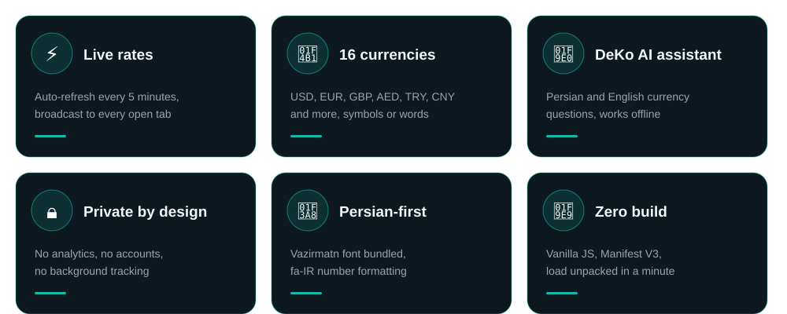
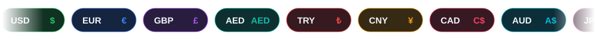
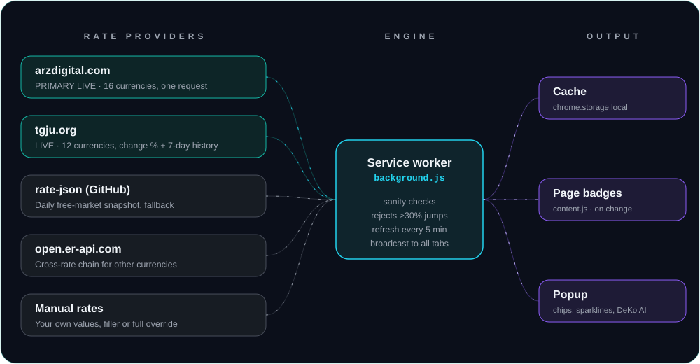

[README.md](https://github.com/user-attachments/files/32976880/README.md)
<div align="center">




</div>

<br/>

**DeKo – Toman Converter** is a Chrome (Manifest V3) extension that detects foreign-currency prices on any web page and appends the **Iranian free-market Toman** equivalent right next to the original price. The original price is never modified.

```
$100       ->  $100 (≈ ۲۵٫۴ میلیون تومان)
€106.99    ->  €106.99 (≈ ۳۰٫۸ میلیون تومان)
$10 - $20  ->  $10 - $20 (≈ ۲٫۵ تا ۵٫۱ میلیون تومان)
```

<div dir="rtl" align="right">

**دِکو** یک افزونه کروم است که قیمت‌های ارزی (دلار، یورو و ...) را در هر سایت پیدا می‌کند و معادل **تومانی بازار آزاد** را کنار قیمت اصلی نشان می‌دهد. قیمت اصلی هیچ‌وقت تغییر نمی‌کند. افزونه دستیار هوشمند ارزی هم دارد.

</div>

<br/>

<div align="center"></div>

<div align="center"></div>

<div align="center"><sub>Illustration of how prices look on a page. Examples use the values from the project notes; live rates change all day.</sub></div>

<br/>

<div align="center"></div>

<div align="center"></div>

<br/>

<div align="center"></div>

<div align="center"></div>

USD, EUR, GBP, AED, TRY, CNY, CAD, AUD, JPY, INR, CHF, RUB, SAR, NZD, KRW and SEK.

- Symbols, codes and Persian words: `$ € £ ¥ ₹ ₺`, `100 USD`, `۱۰۰ دلار`
- Persian, Arabic and Latin digits, and formats like `1,299.99`, `1.299,99` and `1 299`
- Multipliers such as `k`, `M`, `هزار`, `میلیون`, `میلیارد`
- Ranges such as `$10 - $20` and `از ۱۰ تا ۲۰ دلار`
- Amazon split prices and other symbol + number sibling splits
- Single-page apps: a debounced `MutationObserver` plus idle-time chunked scanning

<br/>

<div align="center"></div>

<div align="center"></div>

Everything is kept in **Toman** internally (1 Toman = 10 Rial). Providers are tried as a chain:

| Priority | Source | Role |
|---|---|---|
| 1 | `arzdigital.com` | Primary live anchor. One page fetch carries all 16 DeKo currencies as native free-market quotes |
| 2 | `api.tgju.org` | Live anchor for 12 currencies, plus daily change % and 7-day history for chips and sparklines |
| 3 | `rate-json` on GitHub | Daily free-market snapshot, used as a fallback and currency filler |
| 4 | `open.er-api.com` | Cross-rate chain for every other currency |
| 5 | Manual rates (Options) | Gap filler, or a full override |

**Sanity rules:** only finite, positive values are accepted, and a move of more than 30% against a recent cached value is rejected. If a refresh fails, the cache keeps serving and is flagged **stale**.

**Live updates:** `chrome.alarms` refreshes every 5 minutes. Opening a page asks the service worker for rates and starts a live pull if the last attempt is older than 3 minutes, while the page still paints instantly from cache. Every successful refresh is broadcast to all open tabs, and new badges pulse teal so you can see the update.

<br/>

<div align="center"></div>

<div align="center"></div>

**DeKo AI** is a dedicated offline engine (`deko-ai.js`) that answers Persian and English currency questions from the live rate cache:

> «۱۰۰ دلار چنده؟» · «۲۵ میلیون تومان چند یورو میشه؟» · «نرخ پوند؟» · «روند دلار چطوره؟» · «دلار یا یورو؟»

It reads Persian, Arabic and Latin digits, number words (`دو میلیون و پانصد هزار`), typos (`تومن`, `اورو`) and the symbols `$ € £ ¥`. Chat history is stored locally in `chrome.storage.local` and never sent anywhere.

**Optional real LLM:** in Options you can connect any OpenAI-compatible endpoint (for example OpenRouter). The chat then uses that model with the live rates injected, and silently falls back to the built-in engine on any failure. The API key stays in your browser.

<br/>

<div align="center"></div>

| Option | Choices |
|---|---|
| Display mode | **append** (default), **replace**, **tooltip only** |
| Digits | Persian or English |
| Amount style | Compact (`۳۰٫۸ میلیون`) or full number |
| Symbols | Choose how `$` and `¥` are interpreted |
| Rates | Manual rates, with an optional full override |
| Sites | Master switch, per-site switch, excluded sites |

The popup shows a live USD hero with a daily change chip and a 7-day sparkline, a currency grid with flags, a refresh button and a stale warning. Dark-mode aware badges, RTL-isolated, with `deko-` prefixed DOM classes.

<br/>

<div align="center"></div>

<div align="center"></div>

1. Download or extract this folder (the folder that directly contains `manifest.json`).
2. Open `chrome://extensions` in Chrome, or `edge://extensions` in Edge.
3. Turn on **Developer mode** (top right).
4. Click **Load unpacked** and select that folder.
5. Visit any site with foreign prices.

<br/>

<div align="center"></div>

- No analytics, no accounts, no background tracking.
- The only network calls are made by the service worker to the rate providers listed above. Your browsing history never leaves the browser.
- All rates and chat history are cached locally in `chrome.storage.local` under the `deko2_*` namespace.
- Permissions: `storage`, `alarms`, `activeTab`. Access to all sites is requested as an optional host permission.

Rates are shown for reference only.

<br/>

<div align="center"></div>

```
DeKo-Extension/
├── manifest.json     MV3 manifest
├── background.js     provider chain, sanity checks, 5-minute alarms, tab broadcast
├── content.js        price detection engine (+ content.css)
├── deko-ai.js        offline DeKo AI assistant engine
├── popup.html/js/css the unified popup panel
├── options.html/js/css settings page
├── icons/            extension icons
├── fonts/            Vazirmatn (SIL OFL 1.1)
└── flags/            currency flag icons
```

**For developers:** to add a rate provider, implement `providerX()` returning `{ per: {CUR: toman}, updatedAt, source }` and wire it into `refreshRates()` in `background.js`. Remember: everything is Toman. Persian UI strings are grouped at the top of `content.js` (`STR`) for future i18n.

**v2 fix:** the 1000× Amazon price bug from v1 (a hidden decimal inside the "whole" span) is fixed. v2 prefers Amazon's accessible `.a-offscreen` full price and rejects malformed number groups.

**Credits:** Vazirmatn font (SIL OFL 1.1). Rates from arzdigital, tgju, rate-json and open.er-api.

<div align="center"></div>
